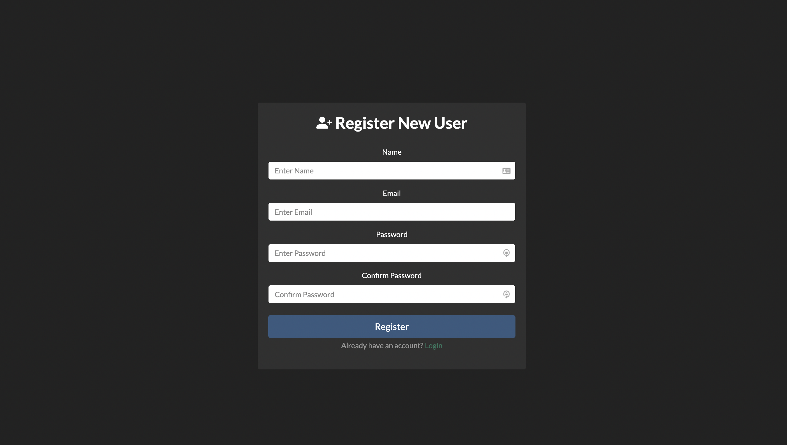

# Nodejs Login System

> You want a comprehensive user sign-up/sign-in system I strongly suggest you take a look at this repo.

## The System Includes

#### Welcome page:


#### The page where the user can register:



#### The system that will send an activation link to your e-mail after registration (The user isn't save to the database without clicking the activation link)

<p align="center">
  
</p>

#### The page where the user can log in


#### Forgot password page


#### Simple dashboard page :)


---

## Technologies Used

1. NodeJS
2. MongoDB
3. Mongoose
4. PassportJS
5. JWT
6. Express
7. EJS
8. Nodemailer
9. BcryptJS
10. Connect-Flash

---

## Installation

##### Clone the latest Repository

`git clone https://github.com/Furkan-Gulsen/nodejs-login-system.git`

##### Installing NPM dependencies

`npm install`

##### Then simply start your app

`npm start`

#### The Server should now be running at http://localhost:3300/

---

**!Note:**

- Environment file and don't forget to add the following values:

```
PASS=***
EMAIL=***
JWT_KEY=***
JWT_RESET_KEY=***
```
